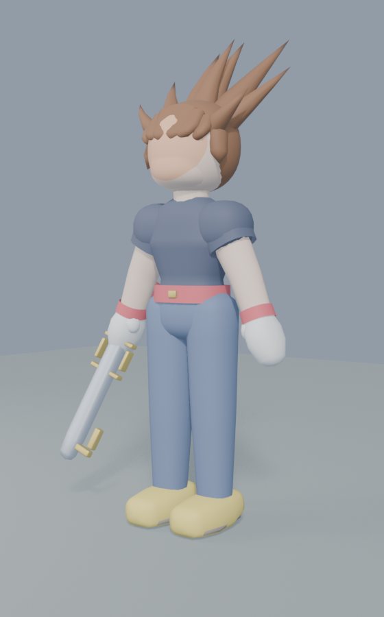
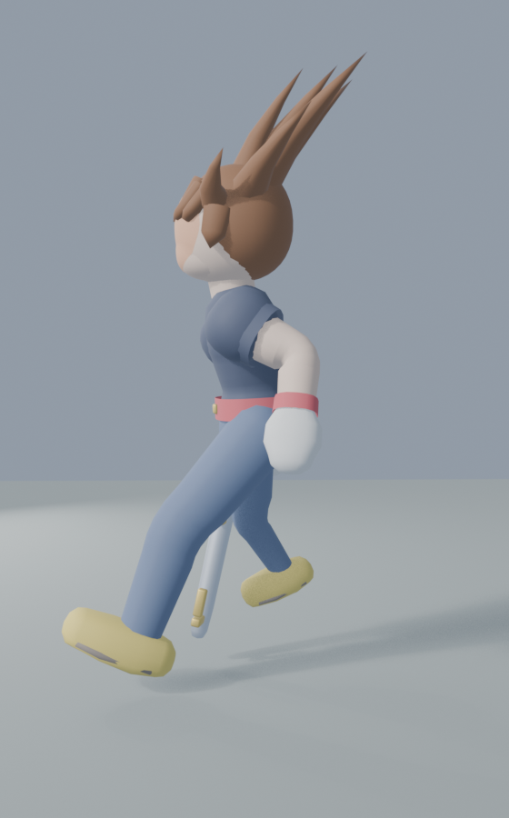
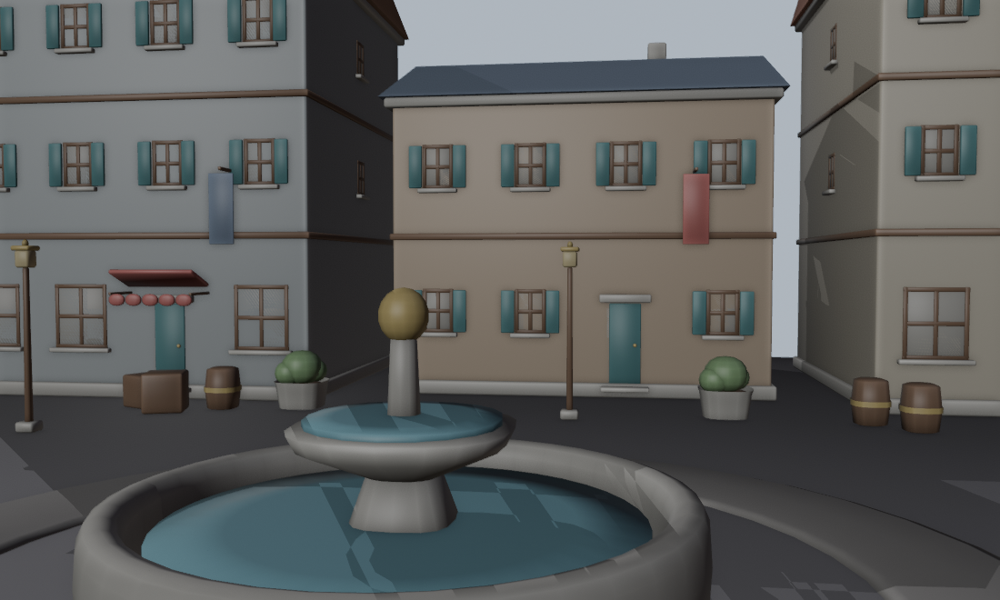
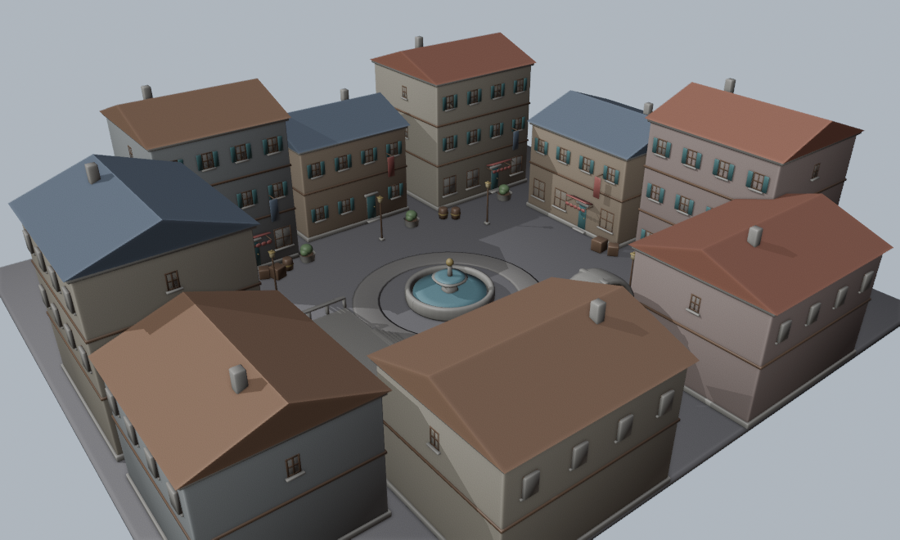
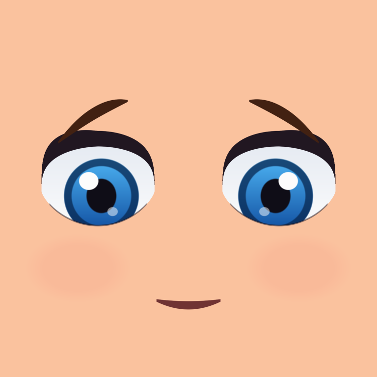

# rpg-3d — style test

A capability probe for a Kingdom Hearts-shaped JRPG: **vinyl-toon forms, real-time
third-person**. Two questions, answered in order:

1. **Characters** — can a hand-scripted Blender pipeline produce a stylised
   character good enough to carry this genre?
2. **Environments** — can a scripted kit produce a space a *free camera*
   survives? Emberbrook could compose one good shot per scene; here the player
   owns the camera.

It is not a game. It is one hero, one town plaza, and an orbit camera.

| | |
|---|---|
|  |  |
|  |  |

The face is drawn, not modelled — this image is wrapped onto a decal that
conforms to the skull:



Everything above is generated by the scripts in `tools/`. There are no
hand-modelled assets and no downloaded ones.

## Run it

```sh
npm install
PORT=3100 node server.js      # port 3000 is Emberbrook's
```

Open **http://localhost:3100**. `WASD`/arrows move (camera-relative), drag to
orbit, wheel to zoom, `space` to jump, `J` to swing.

## Rebuild the assets

```sh
B=/Applications/Blender.app/Contents/MacOS/Blender
$B -b -P tools/hero_build.py -- --out public/assets/hero.glb --render docs/qa/hero
$B -b -P tools/town_build.py -- --out public/assets/town.glb --render docs/qa/town
```

Headless Blender 5.1, no GUI and no MCP addon. `--render` writes preview sheets
to `docs/qa/` — the hero in EEVEE (so the face texture shows), the town in
Workbench — which is the feedback loop: check those before opening the browser.
`tools/face_tex.py` also runs standalone to preview the face as a flat image.

## How it is built

| | |
|---|---|
| `tools/kh_lib.py` | geometry, rig and skin helpers — tubes, superellipsoid blobs, bevelled boxes, armature construction, analytic weights |
| `tools/hero_build.py` | the hero: proportions, skeleton, five animations, face decal, GLB export |
| `tools/face_tex.py` | the face, drawn as an image with numpy — eyes, lash, brows, mouth |
| `tools/arch_lib.py` | the architecture kit — windows, doors, awnings, arches, stairs, lanterns, fountain — plus the `Town` collector |
| `tools/town_build.py` | the plaza layout, collision manifest, preview renders |
| `public/js/toon.js` | the look: banded ramp, rim light, inverted-hull outline, sky gradient |
| `public/js/main.js` | runtime: town loading, collision, ground height, animation state machine, orbit camera |

**Collision is emitted by the code that places the geometry.** `town_build.py`
writes `town.manifest.json` — oriented boxes and lantern positions, converted
into three.js space — in the same run that exports the GLB, so a wall and the
box that blocks you cannot drift apart. Walkable surfaces are tagged in Blender
and joined into a single `FLOOR` mesh that the runtime raycasts for height.

**Nothing is auto-weighted.** Meshes are generated ring-by-ring along a spine and
each ring carries its own `{bone: weight}` dict, so skinning is authored with the
geometry. A bad bend is a data bug with one obvious place to fix it rather than a
weight-paint hunt. `tools/hero_build.py` documents the conventions that make this
work — chiefly that every bone is rolled so **+X rotation is forward flexion
everywhere**, which is what makes the animation code readable.

Two tricks carry more than their weight:

- **The hairline is never modelled.** The hair is a slightly larger blob pushed
  back in +Y; the head pokes out of its front, and the hairline is just the
  intersection curve of the two surfaces. It stays correct for any head shape.
- **The shoulder is a ball centred on the joint, rigid to the arm.** A sphere
  centred on its own rotation axis cannot open a gap no matter how far the arm
  swings. No corrective shapes anywhere on the character.

## What works

- Hero: 14k tris, 11 materials, 17 vertex groups, ~697 KB (five clips + face texture)
- Town: 3,668 placed parts → 95k tris in **19 primitives**, 25 collision boxes,
  ~1.8 MB. Nine buildings, two 1.75 m alleys, a raised terrace, a gateway arch
- Whole scene: **97 draw calls, 324k triangles, ~2.6 ms/frame** (outlines double
  both counts; that is the price of the inverted-hull approach)
- Clean deformation at every joint through a run cycle, a swing and a jump
- **The face is a texture on a conforming decal, not geometry.** Features built
  as separate solids all sit proud of the skull and read as googly eyes glued to
  a ball. Drawing them instead suits the style (a vinyl toy's face is *printed*)
  and makes expressions nearly free later — swap the image, keep the mesh
- Jump with real physics: ~1.4 m apex, tuned to just clear the 1.1 m terrace,
  with `jump` and `land` as separate clips so the poses line up however long the
  character is actually airborne
- Toon banding, rim light, screen-constant outlines, six lantern point lights
- Ground height by raycast with a 0.45 m step-up rule: the stairs climb, the
  1.1 m terrace edge blocks, walking off drops you back down
- Camera collision against the manifest boxes, wall-sliding movement
- `__sim({steps, held, attack, az, polar, dist, warp})` in the browser console
  drives the frame loop deterministically — Chrome throttles rAF in an unfocused
  tab, so automated screenshots need this to capture anything but frame three.

## What is deliberately absent

- **No corridor-aware camera.** In an alley the camera is shoved against a wall
  and pulled to its 0.45 m floor; the hero fades out so you are not inside their
  head. The real fix is a camera that yaws to look *along* a corridor.
- **Feet slide.** Run speed (3.0 m/s) and stride length are eyeballed, not
  matched. Real fix is root motion or a speed-driven timescale.
- No ledge drop-off animation — falls snap instantly to the new height, and
  there is no falling clip (only jump and land).
- The keyblade is rigidly bound to `hand.R` and can clip the hip in extreme
  poses. A real build wants a hand attachment point and per-clip weapon poses.
- One character. The face is now a drawn texture rather than geometry, which
  makes a cast far more tractable — but every character still needs their own
  image, and no expression system exists yet.
- Buildings are solid blocks: no interiors, no enterable doors.

## Traps worth remembering

All of these cost real time here, and all will recur:

- **Derive the camera basis, do not eyeball it.** `right = forward x up` is
  `(-fz, fx)` in three's Y-up right-handed space. The first version used the
  negation and A/D were swapped for the whole build.
- **Rotation-sign conventions must be OBSERVED, not asserted.** `kh_lib` claims
  "+X rotates forward" for every bone. It is true — but every forearm value in
  the animations was authored negative, so every elbow bent backwards, and it
  survived three review passes because a wrong elbow still looks like *an* elbow.
  `render_joint_probe` now photographs one joint at a time so the claim can be
  checked. Note that fixing it broke the weapon-arm poses, which had been tuned
  against the inverted convention and only made sense while it was wrong.
- **`links.new(FROM output, TO input)`.** Reversed, it silently creates no link
  and the texture never reaches the shader.
- **Do not compare bpy structs with `is`.** Blender rebuilds Python wrappers per
  access, so identity checks fail on objects that are genuinely the same. This
  sent me chasing a node-link bug that had already been fixed.
- **Workbench cannot render textures.** It shades from `material.diffuse_color`,
  so the moment the face became a texture the preview stopped being able to show
  the thing being worked on. The hero previews render in EEVEE now.
- **`tube()` ring axes.** The `(rx, ry)` pair maps onto a parallel-transport
  frame whose seed depends on the first tangent. Pass `up=` whenever the two
  radii differ and you care which is which — the fountain wall and the gateway
  arch each silently swapped thickness for depth without it.
- **Open surfaces and outline shells are a bad pair.** An un-capped swept tube
  has no back side, so the camera looks straight through it and sees the *inside*
  of its own inverted-hull shell — which renders as a solid dark blob over half
  the screen. Cap anything the camera can get behind.
