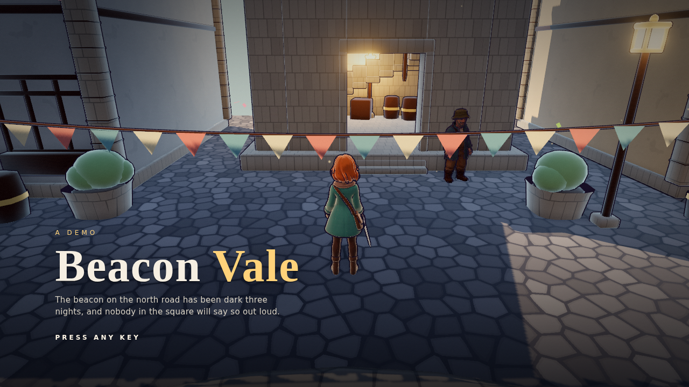
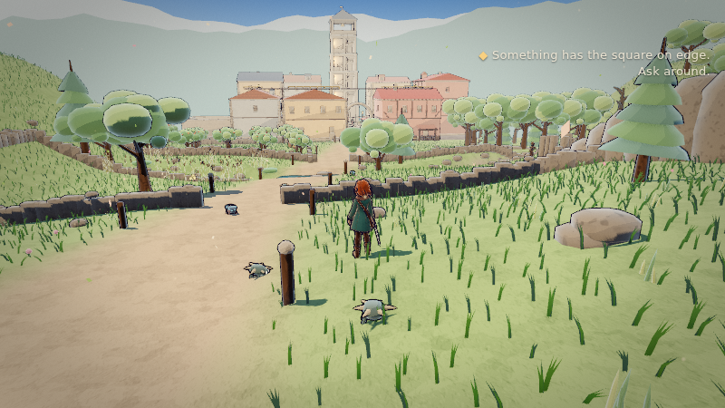
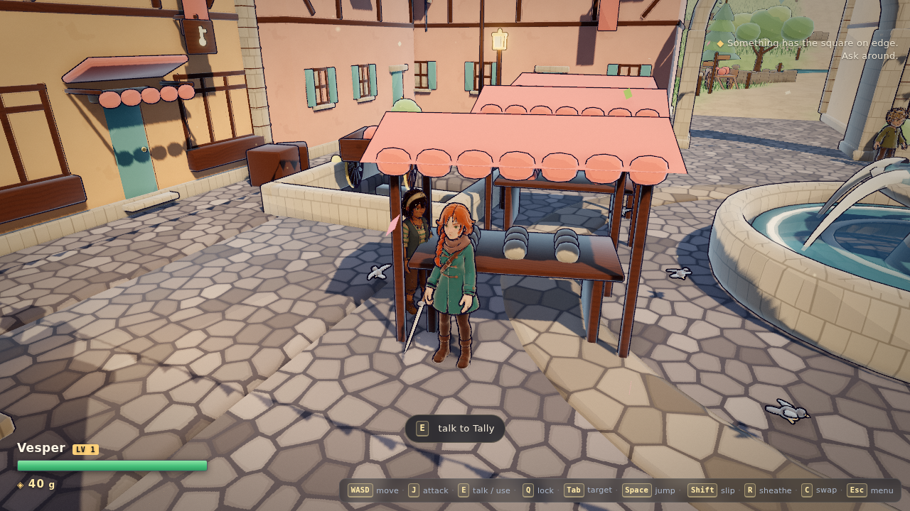
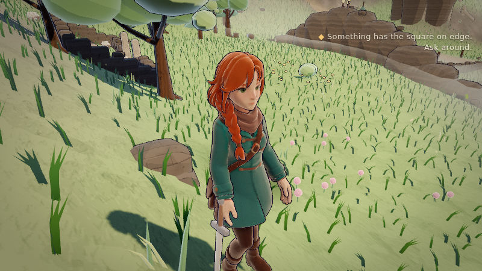
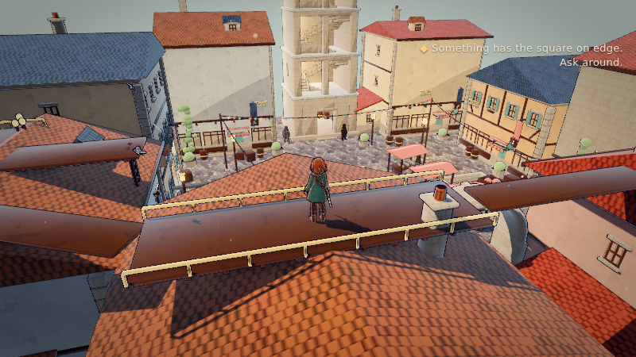
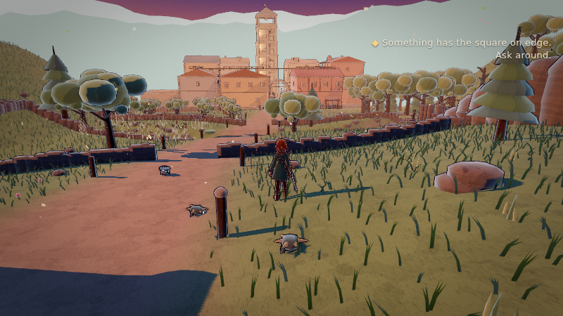
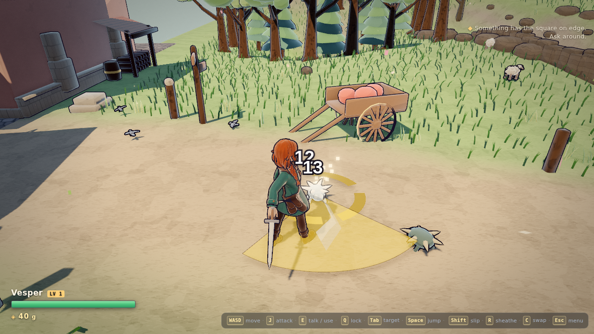
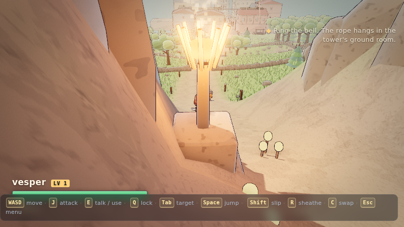

# Beacon Vale

A playable slice of a Kingdom Hearts-shaped JRPG, built entirely from scripts:
**painted toon forms, a real-time third-person camera, a town with people in
it, a valley to cross, and one thing to do.**

| | |
|---|---|
|  |  |
|  |  |
|  |  |
|  |  |

The beacon on the north road has been dark three nights. Ask around the square
and the town will tell you what it wants: five embercaps, gathered from the
walls, the ravine and the roofs, carried up the pass and set. When the coals
take, the valley slides into dusk and the lanterns come up; the bell answers
the beacon; the Sexton sends you to Nell; Nell knows what is at the end of the
east roof lead. Every person you meet reacts to what you have done so far.

Everything here is generated by the scripts in `tools/`. There are no
hand-modelled assets and no downloaded ones. Vesper, Lake and Maren's bodies
came from the Emberbrook project; their rigs, clips, weapons and everything
they stand in were built here.

## What is in it

- **A painted look**: a ten-step toon ramp, a warm key and a blue sky fill,
  an inverted-hull ink line, ambient occlusion, bloom and a display-space
  grade, all live-settable (`__look`, `__post`) so looks can be A/B'd in one
  session. The sky is a dome with its own gradient and sun; the far ridges and
  the clouds are painted and sit outside the fog.
- **A town**: nine buildings with quoins, rafter ends, half-timber braces and
  dormers; a belltower you can climb; a cellar; a roof route; bunting on
  festival masts; a fountain with moving water; stalls whose goods come apart.
- **A valley**: an analytic terrain the runtime and the builder agree on, a
  road that bends, a ford, a ravine, an orchard, a ruin, a stone ring, the
  pass. Trees with roots and branches. Fifteen thousand instanced grass clumps
  in the same wind as the bunting and the canopies.
- **People**: nine townsfolk, each with a portrait, a gesture that is theirs,
  and a dialogue ladder that changes with the state of the world. Three of them
  run errands round the square and stop when you are near.
- **Things you use, not hit**: a beacon that wants fuel, a chest with a lid,
  a bell rope -- timed to the frame of the clip that does them.
- **Combat**: a three-swing combo, a falling cut, lock-on, a dodge, hit-stop,
  damage numbers, drops, an economy, a menu and a shop, with a sheathe you
  control.
- **The air**: dust in the sunlight and petals on the wind, in a box that
  follows you.
- **Sound, with no sound files**: footsteps by surface, swings, hits, the
  bell's partials, the beacon catching, a chest's hinge, wind, birds, water
  and fire by distance, and a quiet pad that warms at dusk -- all synthesised
  in WebAudio the moment they are needed.

## Run it

```sh
npm install
npx playwright install chromium   # the browser is NOT in node_modules
npm run serve                     # symlinks three into public/vendor, serves :3100
```

See `CLAUDE.md` for what can and cannot be changed on a machine without Blender
installed — the short version is everything except geometry and characters.

Open **http://localhost:3100**. `WASD`/arrows move (camera-relative), drag to
orbit, wheel to zoom, `space` to jump, `J` to swing, `E` to talk to a person or
use a thing, `shift` to slip, `Q` to lock on, `Tab` to change target, `R` to
sheathe or draw, `C` to swap character, `M` to mute, `Esc` for the menu. Swing in the air
for the falling cut; land it and you bounce back up. Backquote shows the debug
readout.

Run `node tools/smoke.mjs` to play the whole thing headlessly and assert it
still works — see `docs/COMBAT-BAR.md` for what it covers and why frame time is
deliberately not one of the assertions.

**Vesper, Lake and Maren** — meshes authored for the Emberbrook project,
re-rigged here — share one animation library, and each carries a generated
sword joined into their mesh and weighted to the hand. The scripted five-head hero was
the character *probe*, not a cast member; `tools/hero_build.py` still builds him
as the reference implementation and he hosts the joint probes, but he is not in
the roster.

```sh
# rebuild an externally-authored character
$B -b -P tools/char_build.py -- --name vesper   # or lake / maren
```

## Rebuild the assets

Blender lives in a different place on every machine, so take it from the
environment rather than hard-coding a mac path — the cloud boxes are Linux:

```sh
B=${BLENDER:-/Applications/Blender.app/Contents/MacOS/Blender}   # or /usr/bin/blender
$B -b -P tools/hero_build.py -- --out public/assets/hero.glb --render docs/qa/hero
$B -b -P tools/town_build.py -- --out public/assets/town.glb --render docs/qa/town
$B -b -P tools/meadow_build.py -- --out public/assets/meadow.glb
```

**The meadow's height function is mirrored in `public/js/terrain.js`.** Change
one and you must change the other; `meadow_build.py` emits sample points with
the heights it actually used and the runtime re-evaluates them at load, so the
console tells you the moment the two drift.

## Look at it

```sh
npm run serve                 # http://localhost:3100, correct MIME, no cache
node tools/shots.mjs          # the capture sheet -> docs/shots/
node tools/shots.mjs stream   # just the shots whose name contains "stream"
npm test                      # tools/smoke.mjs, ~20 min, drives the real game
```

`tools/shots.mjs` is the shot list, in the repo, so two rounds of art direction
compare against the same framings instead of against whatever a throwaway script
happened to point at. It drives the game through `__sim`, which steps the loop
by hand — an unaided capture in a throttled headless tab lands mid-lerp on frame
three.

Three A/B knobs exist in the page for exactly one reason, which is that three
separate "lighting bugs" in this project turned out not to be lighting:

| | |
|---|---|
| `__rim(0)` | render the frame with no rim light at all |
| `__shadows(false)` | ...and no shadows. It forces the material recompile that flipping `renderer.shadowMap.enabled` alone does not — without which the A/B renders an identical frame and "proves" shadows were innocent |
| `__freezeEncounters(true)` | stop encounters arming and refilling |

Headless Blender 5.1, no GUI and no MCP addon. `--render` writes preview sheets
to `docs/qa/` — the hero in EEVEE (so the face texture shows), the town in
Workbench — which is the feedback loop: check those before opening the browser.
`tools/face_tex.py` also runs standalone to preview the face as a flat image.

## How it is built

| | |
|---|---|
| `tools/geo_lib.py` | geometry, rig and skin helpers — tubes, superellipsoid blobs, bevelled boxes, armature construction, analytic weights |
| `tools/hero_build.py` | the hero: proportions, skeleton, five animations, face decal, GLB export |
| `tools/face_tex.py` | the face, drawn as an image with numpy — eyes, lash, brows, mouth |
| `tools/anim_lib.py` | the shared clips — bone-name-keyed pose data, character-agnostic |
| `tools/char_build.py` | intake for externally-authored meshes (Vesper, Lake, Maren) |
| `tools/props.py` | hand-held gear — a generated sword, weighted to `hand.R` |
| `tools/arch_lib.py` | the architecture kit — windows, doors, awnings, arches, stairs, lanterns, fountain — plus the `Town` collector |
| `tools/town_build.py` | the plaza layout, collision manifest, preview renders |
| `tools/meadow_build.py` | the terrain function, the path, the stream, the landmark hill and its climb, the distant backdrop |
| `tools/surface_tex.py` | the generated ground and wall textures — cobble, flagstone, grass, dirt, plaster, roof tile, ashlar, timber — all numpy, written with a hand-rolled PNG writer |
| `tools/shots.mjs` | the capture sheet |
| `tools/smoke.mjs` | 46 checks driving the real game in headless Chromium |
| `public/js/toon.js` | the look: banded ramp, rim light, inverted-hull outline, sky gradient |
| `public/js/main.js` | runtime: town loading, collision, ground height, animation state machine, orbit camera |

**Collision is emitted by the code that places the geometry.** `town_build.py`
writes `town.manifest.json` — oriented boxes and lantern positions, converted
into three.js space — in the same run that exports the GLB, so a wall and the
box that blocks you cannot drift apart. Walkable surfaces are tagged in Blender
and joined into a single `FLOOR` mesh that the runtime raycasts for height.

**Nothing is auto-weighted.** Meshes are generated ring-by-ring along a spine and
each ring carries its own `{bone: weight}` dict, so skinning is authored with the
geometry. A bad bend is a data bug with one obvious place to fix it rather than a
weight-paint hunt. `tools/hero_build.py` documents the conventions that make this
work — chiefly that every bone is rolled so **+X rotation is forward flexion
everywhere**, which is what makes the animation code readable.

Two tricks carry more than their weight:

- **The hairline is never modelled.** The hair is a slightly larger blob pushed
  back in +Y; the head pokes out of its front, and the hairline is just the
  intersection curve of the two surfaces. It stays correct for any head shape.
- **The shoulder is a ball centred on the joint, rigid to the arm.** A sphere
  centred on its own rotation axis cannot open a gap no matter how far the arm
  swings. No corrective shapes anywhere on the character.

## What works

- Hero: 14k tris, 11 materials, 17 vertex groups, ~697 KB (five clips + face texture)
- Town: 3,668 placed parts → 95k tris in **19 primitives**, 25 collision boxes,
  ~1.8 MB. Nine buildings, two 1.75 m alleys, a raised terrace, a gateway arch
- Whole scene: **97 draw calls, 324k triangles, ~2.6 ms/frame** (outlines double
  both counts; that is the price of the inverted-hull approach)
- Clean deformation at every joint through a run cycle, a swing and a jump
- **The face is a texture on a conforming decal, not geometry.** Features built
  as separate solids all sit proud of the skull and read as googly eyes glued to
  a ball. Drawing them instead suits the style (a vinyl toy's face is *printed*)
  and makes expressions nearly free later — swap the image, keep the mesh
- Jump with real physics: ~1.4 m apex, tuned to just clear the 1.1 m terrace,
  with `jump` and `land` as separate clips so the poses line up however long the
  character is actually airborne
- Toon banding, rim light, screen-constant outlines, six lantern point lights
- Ground height by raycast with a 0.45 m step-up rule: the stairs climb, the
  1.1 m terrace edge blocks, walking off drops you back down
- **Analytic two-bone foot IK.** Clips are joint ANGLES, which is what makes
  them portable — and exactly why feet do not land: the contact pose that plants
  the hero leaves Vesper's foot above the floor, because her legs are
  proportionally longer and her soles far thinner. Authoring per character would
  fix the symptom and destroy the portability, so the solve happens at runtime.
  Only ankle HEIGHT is retargeted, so the stride is untouched, and the
  correction eases out as a foot lifts so a swinging leg is never yanked.
  `__ik.value = false` in the console A/Bs it
- Camera collision against the manifest boxes, wall-sliding movement
- `__sim({steps, held, attack, az, polar, dist, warp})` in the browser console
  drives the frame loop deterministically — Chrome throttles rAF in an unfocused
  tab, so automated screenshots need this to capture anything but frame three.

## What is deliberately absent

- **No corridor-aware camera.** In an alley the camera is shoved against a wall
  and pulled to its 0.45 m floor; the hero fades out so you are not inside their
  head. The real fix is a camera that yaws to look *along* a corridor.
- **Feet slide.** Run speed (3.0 m/s) and stride length are eyeballed, not
  matched. Foot IK plants the feet vertically but does not lock them
  horizontally; the real fix is root motion or a speed-driven timescale.
- **Foot IK does not orient the foot.** It targets the ankle and assumes the
  sole is flat, so a foot pitched mid-stride still contacts a couple of
  centimetres off. Levelling the foot to the ground normal is the next step.
- **Foot IK ignores sub-centimetre errors by design** (see the trap below), so
  a character at rest is planted by the POSE, not by the solver.
- No ledge drop-off animation — falls snap instantly to the new height, and
  there is no falling clip (only jump and land).
- The sword is rigidly bound to `hand.R` and can clip the hip in extreme
  poses. A real build wants a hand attachment point and per-clip weapon poses.
- The scripted hero's face is a drawn texture rather than geometry, which makes
  a cast far more tractable — but no expression system exists yet.
- The imported cast are ~42k triangles each against the hero's 14k, and their
  realistic proportions sit oddly beside his five-head build. That clash is a
  casting decision nobody has made yet.
- Buildings are solid blocks: no interiors, no enterable doors.

## Traps worth remembering

All of these cost real time here, and all will recur:

- **Derive the camera basis, do not eyeball it.** `right = forward x up` is
  `(-fz, fx)` in three's Y-up right-handed space. The first version used the
  negation and A/D were swapped for the whole build.
- **Rotation-sign conventions must be OBSERVED, not asserted.** `geo_lib` claims
  "+X rotates forward" for every bone. It is true — but every forearm value in
  the animations was authored negative, so every elbow bent backwards, and it
  survived three review passes because a wrong elbow still looks like *an* elbow.
  `render_joint_probe` now photographs one joint at a time so the claim can be
  checked. Note that fixing it broke the weapon-arm poses, which had been tuned
  against the inverted convention and only made sense while it was wrong.
- **`links.new(FROM output, TO input)`.** Reversed, it silently creates no link
  and the texture never reaches the shader.
- **Do not compare bpy structs with `is`.** Blender rebuilds Python wrappers per
  access, so identity checks fail on objects that are genuinely the same. This
  sent me chasing a node-link bug that had already been fixed.
- **Never stand a character on locked knees.** Two-bone IK degenerates at full
  extension: the knee's sideways position goes as sqrt(slack), so at ~99.7%
  extension a 3 mm ground correction demands ~36 mm of knee swing, and idle
  breathing turns that into a violent per-frame flicker. The fix was the POSE,
  not the solver — a few degrees of knee flexion is anatomically right and
  numerically well-behaved. Idle knee jitter went from ~50-78 mm to ~2 mm.
  Related: an IK solve is only a safe no-op at zero correction if it uses the
  ANIMATED bend plane; forcing the knee's own hinge relocates the knee even when
  nothing needs fixing, so fading the correction out snaps it.
- **A hard "skip tiny corrections" test is worse than none.** It is a
  discontinuity, and it snapped the knee every time it was crossed. Ramp
  instead.
- **The sideways rotation axis is NOT mirrored.** Unlike forward flexion, whose
  sign means the same thing on both sides, `+Z` swings the left arm out and the
  right arm across the body. Writing the same sign on both crossed the arms
  behind the back through every jump.
- **Workbench cannot render textures.** It shades from `material.diffuse_color`,
  so the moment the face became a texture the preview stopped being able to show
  the thing being worked on. The hero previews render in EEVEE now.
- **`tube()` ring axes.** The `(rx, ry)` pair maps onto a parallel-transport
  frame whose seed depends on the first tangent. Pass `up=` whenever the two
  radii differ and you care which is which — the fountain wall and the gateway
  arch each silently swapped thickness for depth without it.
- **Open surfaces and outline shells are a bad pair.** An un-capped swept tube
  has no back side, so the camera looks straight through it and sees the *inside*
  of its own inverted-hull shell — which renders as a solid dark blob over half
  the screen. Cap anything the camera can get behind.
